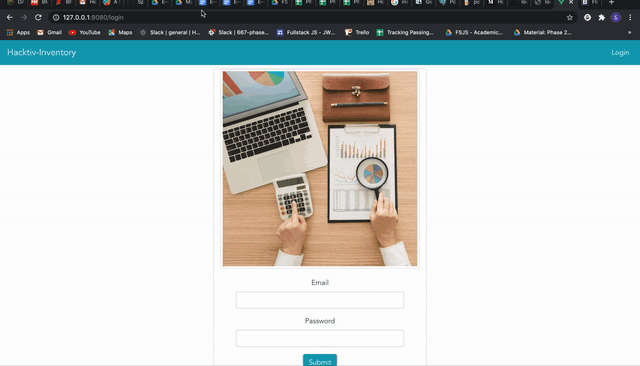

# Phase 2 - Live Code Simulasi

## Hacktiv-Inventory
Pada kali ini kalian akan membuat sebuah website untuk menyimpan data inventory hacktiv, namun karena hanya untuk simulasi maka kita hanya akan membuat fitur register (hanya server), login, show inventory.

### Summary

- -10 Point jika Tidak SPA, membutuh refresh untuk menjalankan salah satu/semua fitur
- -20 tidak menggunakan sequelize n postgres atau tidak menggunakan project hasil vue cli
- -5 tidak memberikan environtment variables beserta valuenya jika ybs menggunakan env
- -10 using alert()
- -2 routing tidak di protect (misal sudah login, masih bisa ke /login, belum login bisa ke home), cara student protect routes bebas

## Release 0 - Authentication

### Server - Register
- Lakukan register sesuai api-doc.md

### Server - Login
- Lakukan login sesuai api-doc.md

### Client - Login & Logout
- jika sudah login, kalau direfresh tidak harus login lagi
- buatlah routing dan views untuk form login
- jika login berhasil maka akan ke routing '/' yang akan menampilkan semua data inventory yang ada di database
NOTES: REGISTER CLIENT TIDAK PERLU ADA

## Release 1 - Fetch Inventories

### Server
- Lakukan Fetch sesuai api-doc.md

### Client
- buatlah routing di client untuk menampilkan list data inventory yang ada
